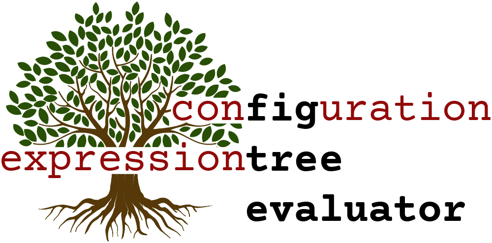

# fig-tree-evaluator



**FigTree Evaluator** is a module to evaluate JSON-structured expression trees. 

A typical use case would be for evaluating **configuration** files, where you need to store dynamic values or arbitrary logic without allowing users to inject executable code (perhaps in a .json file, say). Examples could include: 

- a [form-builder app](https://github.com/openmsupply/conforma-web-app) might need to allow complex conditional logic for form element visibility based on previous responses, or for validation beyond what is available in standard validation libraries.
- configure a [decision tree](https://en.wikipedia.org/wiki/Decision_tree) to implement branching logic. (See implementation in `20_match.test.ts`)
- extend [JSON Forms](https://jsonforms.io) with more complex logic and dynamic lookups: https://github.com/CarlosNZ/jsonforms-with-figtree-demo

A range of built-in operators are available, from simple logic, arithmetic and string manipulation, to data fetching from local sources or remote APIs.

[**Demo/Playground**](https://carlosnz.github.io/fig-tree-evaluator/)

## Contents <!-- omit in toc -->
<!-- TOC -->
- [The basics](#the-basics)
- [Install](#install)
- [Usage](#usage)
- [Available options](#available-options)
- [Operator nodes](#operator-nodes)
  - [Other common properties:](#other-common-properties)
  - [Operator \& Property Aliases](#operator--property-aliases)
- [Operator reference](#operator-reference)
  - [AND](#and)
  - [OR](#or)
  - [EQUAL](#equal)
  - [NOT\_EQUAL](#not_equal)
  - [PLUS](#plus)
  - [SUBTRACT](#subtract)
  - [MULTIPLY](#multiply)
  - [DIVIDE](#divide)
  - [GREATER\_THAN](#greater_than)
  - [LESS\_THAN](#less_than)
  - [COUNT](#count)
  - [CONDITIONAL](#conditional)
  - [REGEX](#regex)
  - [OBJECT\_PROPERTIES](#object_properties)
  - [STRING\_SUBSTITUTION](#string_substitution)
  - [SPLIT](#split)
  - [GET](#get)
  - [POST](#post)
  - [GRAPHQL](#graphql)
  - [SQL](#sql)
  - [BUILD\_OBJECT](#build_object)
  - [MATCH](#match)
  - [PASSTHRU](#passthru)
  - [CUSTOM\_FUNCTIONS](#custom_functions)
- [Alias Nodes](#alias-nodes)
- [Fragments](#fragments)
- [Shorthand syntax](#shorthand-syntax)
- [Caching (Memoization)](#caching-memoization)
- [Metadata](#metadata)
- [More examples](#more-examples)
- [Development environment](#development-environment)
- [Tests](#tests)
- [Help, Feedback, Suggestions](#help-feedback-suggestions)
- [Changelog](#changelog)
- [Credit](#credit)

<!-- /TOC -->
## The basics

Fig-tree evaluates expressions structured in a JSON/Javascript object [expression tree](https://www.geeksforgeeks.org/expression-tree/). A single "node" of the tree consists of an **Operator**, with associated parameters (or child nodes), each of which can itself be another Operator node -- i.e. a recursive tree structure of arbitrary depth and complexity.

A wide range of [operators are available](#operator-reference), but [custom functions](#custom_functions) can be added to your implementation if you wish to extend the base functionality.

For example:

```js
{
    operator: "+", // "Addition" operator
    values: [1, 2, 3]
}
// -> 6
```

Or, with a deeper structure that results in the same final output:
```js
{
  operator: '+',
  values: [
    {
      operator: '?', // conditional
      condition: {
        operator: '=', // equality
        values: [
          {
            operator: 'objectProperties', // extracted from passed-in object
            property: 'responses.Q1',
          },
          'correct',
        ],
      },
      valueIfTrue: 1,
      valueIfFalse: 0,
    },
    {
      operator: 'GET', // API lookup
      url: 'https://my.server.com/api/get-count',
    },
    3,
  ],
}
// -> 6
```

Which would be represented diagrammatically with the following expression tree:


A playground for building and testing expressions is available [here](https://carlosnz.github.io/fig-tree-evaluator/)

## Install

`npm install fig-tree-evaluator`\
or\
`yarn add fig-tree-evaluator`

## Usage

```js
import { FigTreeEvaluator } from 'fig-tree-evaluator'

// New evaluator instance
const fig = new FigTreeEvaluator([ options ]) // See available options below

// Evaluate expressions
fig.evaluate(expression, [options]) // Options over-ride initial options for this evaluation
    .then((result) => { // "evaluate" is async method
        // Do something with result
    })

// Or within async function:
const result = await fig.evaluate(expression, [options])
```

FigTreeEvaluator is written in **Typescript**, and the following types are available to import from the package:
- `FigTreeOptions`: `options` object, as per [options](#available-options) below
- `Operator`: string literal canonical [Operator](#operator-nodes) names (`AND`, `OR`, `EQUAL`, etc.)
- `EvaluatorNode`: Evaluator input
- `EvaluatorOutput`

## Available options

The `options` parameter is an object with the following available properties (all optional):

- `data` -- a single object containing any *objects* in your application that may wish to be inspected using the [objectProperties](#object_properties) operator. (See [playground](LINK) for examples). If these objects are regularly changing, you'll probably want to pass them into each separate evaluation rather than with the initial constructor.
- `functions` -- a single object containing any *custom functions* available for use by the [customFunctions](#custom_functions) operator.
- `fragments` -- commonly-used expressions (with optional parameters) that can be re-used in any other expression. See [Fragments](#fragments)
- `sqlConnection` -- if you wish to make calls to an SQL database using the [`SQL` operator](#sql), pass a connection to the database here. See operator details below.
- `graphQLConnection` -- a GraphQL connection object, if using the [`graphQL` operator](#graphql). See operator details below.
- `baseEndpoint` -- A general http headers object that will be passed to *all* http-based operators (`GET`, `POST`, `GraphQL`). Useful if all http queries are to a common server -- then each individual node will only require a relative url. See specific operator for more details.
- `headers` -- A general http headers object that will be passed to *all* http-based operators. Useful for authentication headers, for example. Each operator and instance can have its own headers, though, so see specific operator reference for details.
- `returnErrorAsString` -- by default the evaluator will throw errors with invalid evaluation expressions (with helpful error messages indicating the node which threw the error and what the problem was). But if you have `returnErrorAsString: true` set, the evaluator will never throw, but instead return error messages as a valid string output. (See also the [`fallback`](#other-common-properties) parameter below)
- `allowJSONStringInput` -- the evaluator is expecting the input expression to be a javascript object. However, it will also accept JSON strings if this option is set to `true`. We have to perform additional logic on every evaluation input to determine if a string is a JSON expression or a standard string, so this is skipped by default for performance reasons. However, if you want to send (for example) user input directly to the evaluator without running it through your own `JSON.parse()`, then enable this option.
- `skipRuntimeTypeCheck` -- we perform comprehensive type checking at runtime to ensure that each operator only performs its operation on valid inputs. If type checking fails, we throw an error detailing the explicit problem. However, if `skipRuntimeTypeCheck` is set to `true`, then all inputs are passed to the operator regardless, and any errors will come from whatever standard javascript errors might be encountered (e.g. trying to pass a primitive value when an array is expected => `.map is not a function`)
- `caseInsensitive` -- this only affects the [`equal`/`notEqual` operators](#equal) (see there for more detail). 
- `nullEqualsUndefined` -- this only affects the [`equal`/`notEqual` operators](#equal) (see there for more detail). 
- `evaluateFullObject` -- by default, FigTree expects the root of an input expression to be an [Operator Node](#operator-nodes), and if not, will return the input unmodified. However, you may have cases where the evaluation expressions are deep within a larger structure (such as a JSON schema, for example). In this case, you can set `evaluateFullObject` to `true` and the evaluator will find *any* operator nodes within the structure and evaluate them within the object tree.
- `excludeOperators` -- an array of operator names (or [aliases](#operator--property-aliases)) to prohibit from being used in expressions. You may wish to restrict (for example) database access via FigTree configurations, in which case these exclusions can be defined when instantiating the FigTree instance (or updated on the fly).
- `useCache` -- caches the results from certain operators to avoid repeated network requests with the same input values. By default, this is set to `true`, and it can be overridden for specific nodes. See [Memoization/Caching section](#caching-memoization) for more detail
- `maxCacheSize` -- the maximum number of results that will be held in the aforementioned cache (default: `50`)
- `maxCacheTime` -- the maximum time (in seconds) that a result will be cached since last access (default: `1800` (30 minutes))
- `noShorthand` -- there is a [shorthand syntax](#shorthand-syntax) available for writing expressions. Internally, this is pre-processed into the standard expression form before evaluation. If you have no use for this and you'd rather all expressions were written with full verbosity, set `noShorthand: true` to save a small amount in performance by skipping internal pre-processing.

As mentioned above, `options` can be provided as part of the constructor as part of each separate evaluation. You can also change the options permanently for a given evaluator instance with:

`fig.updateOptions(options)`

You can also retrieve the current options state at any time with:

`fig.getOptions()`

It's also possible to run one-off evaluations by importing the evaluation method directly rather than using the constructor:

```js
import { evaluateExpression } from 'fig-tree-evaluator'

evaluateExpression(expression, [options]).then((result) => {
    // Do something with result
})
```

## Operator nodes

Each operator has a selections of input properties associated with it, some required, some optional. For example, the `conditional` operator requires inputs equivalent to the javascript ternary operator, and are expressed as follows:

```js
{
    operator: "conditional", // or "?"
    condition: <boolean>, // or fig-tree expression that returns boolean
    valueIfTrue: <someValue>,
    valueIfFalse: <someOtherValue>

}
```

However, it is also possible to provide the operator properties (or "operands") as a single `children` array, in which case the specific properties are interpreted positionally.

For example, the following two representations are equivalent `conditional` operator nodes:

```js
{
    operator: "?", // conditional (alias)
    condition: 1 + 1 ==== 2,
    valueIfTrue: "True output",
    valueIfFalse: "False output"
}

// same as:

{
    operator: "?",
    children: [ 1 + 2 === 2, "True output", "False output" ]
}
```

Most of the time named properties would be preferable; however there are occasional cases where the "children" array might be easier to deal with, or to build up from child nodes.

### Other common properties:

In each operator node, as well as the operator-specific properties, the following three optional properties can be provided:

- `fallback`: if the operation throws an error, the `fallback` value will be returned instead. The `fallback` property can be provided at any level of the expression tree and bubbled up from where errors are caught to parent nodes. *Fallbacks are strongly recommended if there is any chance of an error (e.g. a network "GET" request that doesn't yet have its parameters defined).*
- `outputType` (or `type`): will convert the result of the current node to the specified `outputType`. Valid values are `string`, `number`, `boolean` (or `bool`), and `array`. You can experiment in the [demo app](https://carlosnz.github.io/fig-tree-evaluator/) to see the outcome of applying different `outputType` values to various results.
- `useCache`: Overrides the global `useCache` value (from [options](#available-options)) for this node only. See [Caching/Memoization](#caching-memoization) below for more info.

Remember that *all* operator node properties can themselves be operator nodes, *including* the `fallback` and `outputType` properties.

e.g.

```js
// Dynamic outputType, which uses the fallback value due to missing property
// for the conditional '?' operator:
{
  operator: '+',
  values: [9, 10, 11],
  outputType: {
    operator: '?',
    condition: {
      operator: '=',
      values: ['three', 'four'],
    },
    valueIfTrue: 'number',
    fallback: 'string',
  },
}
// => "30"

```

### Operator & Property Aliases

For maximal flexibility, all operator names are case-insensitive, and also come with a selection of "aliases" that can be used instead, based on context or preference (e.g. the `conditional` operator can also be aliased as `?` or `ifThen`). See specific operator reference for all available aliases.

Similarly, some property names accept aliases -- see individual operators for these.

## Operator reference

The full list of available operators and their associated properties:

<sup>*</sup> denotes "required" properties

### AND

*Logical AND*

Aliases: `and`, `&`, `&&`

#### Properties

- `values`<sup>*</sup>: (array) -- any number of elements; will be compared using Javascript `&&` operator

e.g.
```js
{
  operator: '&',
  values: [true, true, true],
}
// => true
```

`children` array: `[...values]`

----
### OR

*Logical OR*

Aliases: `or`, `|`, `||`

#### Properties

- `values`<sup>*</sup>: (array) -- any number of elements; will be compared using Javascript `||` operator

e.g.
```js
{
  operator: 'or',
  values: [
    true,
    {
      operator: 'and',
      values: [true, false],
    },
    true,
  ],
}
// => true
```

`children` array: `[...values]`

----
### EQUAL

*Equality*

Aliases: `=`, `eq`, `equal`, `equals`

#### Properties

- `values`<sup>*</sup>: (array) -- any number of elements; will be compared for strict equality. This includes simple types as well as deep equality of objects and arrays.
- `caseInsensitive`: (boolean, default `false`) -- when comparing string values, if this property is `true`, the case of the strings will be ignored (e.g. `"Monday" == "mONdAY"`)
- `nullEqualsUndefined`: (boolean, default `false`) -- there are times when it is convenient for `null` to be considered equal to `undefined`. If this is desired, set this property to `true`, otherwise all equality checks will be "strict" equality. If you find that you want this setting enabled globally, then you can set it in the overall [evaluator options](#available-options) instead of having to add this additional property to every equality expression.

e.g.
```js
{
  operator: '=',
  values: [3, 3, 'three'],
}
// => false
```

`children` array: `[...values]`

----
### NOT_EQUAL

*Non-equality*

Aliases: `!=`, `!`, `ne`, `notEqual`

#### Properties

- `values`<sup>*</sup>: (array) -- any number of elements; will be compared for inequality. This includes simple types as well as deep comparison of objects and arrays.
- `caseInsensitive`: (boolean, default `false`) -- as [above](#equal)
- `nullEqualsUndefined`: (boolean, default `false`) -- as [above](#equal)

e.g.
```js
{
  operator: '=',
  values: [3, 3, 'three'],
}
// => true
```

`children` array: `[...values]`

----
### PLUS

*Addition, concatenation, merging*

Aliases: `+`, `add`, `concat`, `join`, `merge`

#### Properties

- `values`<sup>*</sup>: (array) -- any number of elements. Will be added (numbers), concatenated (strings, arrays) or merged (objects) according their type.
- `type`: (`'string' | 'array'`) -- if specified, operator will treat the `values` as though they were this type. E.g. if `string`, it will concatenate the values, even if they're all numbers. The difference between this property and the common [`outputType` property](#other-common-properties) is that `outputType` converts the result, whereas this `type` property converts each element *before* the "PLUS" operation. 

e.g.
```js
{
  operator: '+',
  values: [4, 5, 6],
}
// => 15

{
  operator: '+',
  values: ['this', ' and ', 'that'],
}
// => 'this and that'

{
  operator: '+',
  values: [{one: 1, two: 2}, {three: 3}],
}
// => {one: 1, two: 2, three: 3}

{
  operator: '+',
  values: [4, 5, 6],
  type: 'string'
}
// => "456"

{
  operator: '+',
  values: [4, 5, 6],
  type: 'array'
}
// => [4, 5, 6]

```

`children` array: `[...values]`

----
### SUBTRACT

*Subtraction*

Aliases: `-`, `subtract`, `minus`, `takeaway`

#### Properties

- `values`<sup>*</sup>: (array) -- exactly 2 numerical elements; the second will be subtracted from the first. (If non-numerical elements are provided, the operator will return `NaN`)

e.g.
```js
{
  operator: '-',
  values: [10, 8],
}
// => 2

{
  operator: 'minus',
  values: [0, 3.5, 10], // additional elements after the first two ignored
}
// => -3.5

{
  operator: '-',
  values: [4, "three"],
}
// => NaN
```

`children` array: `[originalValue, valueToSubtract]` (same as `values`)

----
### MULTIPLY

*Multiplication*

Aliases: `*`, `x`, `multiply`, `times`

#### Properties

- `values`<sup>*</sup>: (array) -- any number of numerical elements. Returns the product of all elements.  (If non-numerical elements are provided, the operator will return `NaN`)

e.g.
```js
{
  operator: '*',
  values: [5, 7],
}
// => 35

{
  operator: 'x',
  values: [2, 3.5, 10], // additional elements after the first two ignored
}
// => 70

{
  operator: 'times',
  values: [4, "three"],
}
// => NaN
```

`children` array: `[...values]`

----
### DIVIDE

*Division*

Aliases: `/`, `divide`, `÷`

#### Properties

- `values`: (array) -- exactly 2 numerical elements; the first will be divided by the second.  (If non-numerical elements are provided, the operator will return `NaN`)
- `dividend` (or `divide`): (number) -- the number that will be divided
- `divisor` (or `by`): (number) -- the number to divide `dividend` by
- `output` (`'quotient' | 'remainder'`) -- by default, the operator returns a floating point value. However, if `quotient` is specified, it will return the integer part of the result; if `remainder` is specified, it will return the remainder after division (i.e. `value1 % value2`)

Note that the input values can be provided as *either* a `values` array *or* `dividend`/`divisor` properties. If both are provided, `values` takes precedence.

e.g.
```js
{
  operator: '/',
  values: [35, 7],
}
// => 5

{
  operator: '/',
  divide: 20,
  by: 3,
  output: 'quotient' 
}
// => 6

{
  operator: 'divide',
  dividend: 20,
  divisor: 3,
  output: 'remainder'
}
// => 2
```

`children` array: `[dividend, divisor]` (same as `values`)

----
### GREATER_THAN

*Greater than (or equal to)*

Aliases: `>`, `greaterThan`, `higher`, `larger`

#### Properties

- `values`<sup>*</sup>: (array) -- exactly 2 values. Can be any type of value that can be compared with Javascript `>` operator.
- `strict`: (boolean, default `false`) -- if `true`, value 1 must be strictly greater than value 2 (i.e. `>`). Otherwise it will be compared with "greater than or equal to" (i.e. `>=`)

e.g.
```js
{
  operator: '>',
  values: [10, 8]
}
// => true

{
  operator: '>',
  values: ["alpha", "beta"]
}
// => false

{
  operator: '>',
  values: [4, 4],
  strict: true
}
// => false
```

`children` array: `[firstValue, secondValue]` (same as `values`)

----
### LESS_THAN

*Less than (or equal to)*

Aliases: `<`, `lessThan`, `lower`, `smaller`

#### Properties

- `values`<sup>*</sup>: (array) -- exactly 2 values. Can be any type of value that can be compared with Javascript `<` operator.
- `strict`: (boolean, default `false`) -- if `true`, value 1 must be strictly lower than value 2 (i.e. `<`). Otherwise it will be compared with "less than or equal to" (i.e. `<=`)

e.g.
```js
{
  operator: '<',
  values: [10, 8]
}
// => false

{
  operator: '<',
  values: ["alpha", "beta"]
}
// => true

{
  operator: '<',
  values: [4, 4],
  strict: false
}
// => true
```

`children` array: `[firstValue, secondValue]` (same as `values`)

----
### COUNT

*Count elements in array*

Aliases: `count`, `length`

#### Properties

- `values`<sup>*</sup>: (array) -- any number of elements. Returns `array.length`

e.g.
```js
{
  operator: 'count',
  values: [10, 8, "three", "four"]
}
// => 4
```

`children` array: `[...values]`

----
### CONDITIONAL

*Return different values depending on a condition expression*

Aliases: `?`, `conditional`, `ifThen`

#### Properties

- `condition`<sup>*</sup>: (boolean) -- a boolean value (presumably the result of a child expression)
- `valueIfTrue` (or `ifTrue`)<sup>*</sup>: the value returned if `condition` is `true`
- `valueIfFalse` (or `ifFalse`)<sup>*</sup>: the value returned if `condition` is `false`

e.g.
```js
{
  operator: '?',
  condition: {
    operator: '=',
    values: [
      {
        operator: '+',
        values: [5, 5, 10],
      },
      20,
    ],
  },
  ifTrue: 'YES',
  ifFalse: 'NO',
}
// => YES
```

`children` array: `[condition, valueIfTrue, valueIfFalse]`

**Note**: *For more complex branching logic, the ["match" operator](#match) can be used (it matches more than just a boolean condition)*

----
### REGEX

*Compares an input string against a [regular expression](https://developer.mozilla.org/en-US/docs/Web/JavaScript/Guide/Regular_Expressions) pattern*

Aliases: `regex`, `patternMatch`, `regexp`, `matchPattern`

#### Properties

- `testString` (or `string`, `value`)<sup>*</sup>: (string) -- the string to be compared against the regex pattern
- `pattern` (or `regex`, `regexp`, `regExp`, `re`)<sup>*</sup>: (string) a regex pattern to test `testString` against

Returns `true` (match found) or `false` (no match)

e.g.
```js
{
  operator: 'regex',
  string: "home@myplace.com",
  pattern: '^[A-Za-z0-9.]+@[A-Za-z0-9]+\\.[A-Za-z0-9.]+$'  // Simple Email validation
}
// => true
```

`children` array: `[testString, pattern]`

----
### OBJECT_PROPERTIES

*Extracts values from data objects in your application*

Aliases: `objectProperties`, `dataProperties`,`data`, `getData`, `objProps`, `getProperty`, `getObjProp`

#### Properties

- `property` (or `path`, `propertyName`)<sup>*</sup>: (string) -- the path to the required property in the object
- `additionalData` (or `additionalObjects`, `additional`, `data`): (object) -- any other objects whose properties can be referenced in `property` (see below)

Data objects are normally expected to be passed in to the evaluator as part of the [options](#available-options), not as part of the expression itself. This is because the source objects are expected to be values internal to your application, whereas the evaluator provides an externally configurable mechanism to extract (and process) application data. (However, it is possible to pass data objects directly as part of the expression using the `additionalObjects` property, so (in theory) data objects could be dynamically generated from other expressions.)

For example, consider a `user` object and an fig-tree evaluator instance: 

```js
const user = {
  firstName: 'Peter',
  lastName: 'Parker',
  alias: 'Spider-man',
  friends: ['Ned', 'MJ', 'Peter 2', 'Peter 3'],
  enemies: [
    { name: 'The Vulture', identity: 'Adrian Toomes' },
    { name: 'Green Goblin', identity: 'Norman Osborne' },
  ],
}

const fig = new FigTreeEvaluator()

const expression = getExpressionFromConfig()

fig.evaluate(expression, { data: { user } })
```

Here is the result of various values of `expression:`

```js
{
  operator: 'objectProperties',
  property: 'user.firstName',
}
// => "Peter"

{
  operator: 'getData',
  path: 'user.friends[1]',
}
// => "MJ"

{
  operator: 'getProperty',
  path: 'user.enemies.name',
}
// => ["The Vulture", "Green Goblin"]
```
Notice the last example pulls multiple values out of an array of objects, in this case the "name". This is essentially a shorthand for:

```js
fig.evaluate(
    { operator: 'getProperty', path: 'user.enemies' },
    { data: { user } }
  ).map((e) => e.name)
```

The "objectProperties" operator uses [`object-property-extractor`](https://www.npmjs.com/package/object-property-extractor) internally, so please see the documentation of that package for more information.

The "objectProperties" operator will throw an error if an invalid path is provided, so it is recommended to provide a [`fallback`](#other-common-properties) value for the expression:
```js
{
  operator: 'objectProperties',
  property: 'user.middleName',
  fallback: 'Not found!'
}
// => "Not found!"
```

`children` array: `[property]`


Example using "data" passed in dynamically as part of expression:

```js
{
  operator: 'objectProperties',
  property: 'user.name',
  additionalData: {
    operator: '?',
    condition: { operator: '=', values: [{ operator: '+', values: [7, 8, 9] }, 25] },
    valueIfTrue: { user: { name: 'Bilbo' } },
    valueIfFalse: { user: { name: 'Frodo' } },
  },
}
// => "Frodo"
```

----
### STRING_SUBSTITUTION

*Replace values in a string using simple parameter (positional or named properties) substitution*

Aliases: `stringSubstitution`, `substitute`, `stringSub`, `replace`

#### Properties

- `string`<sup>*</sup>: (string) -- a parameterized (`%1`, `%2`, or `{{named}}`) string, where the parameters are to be replaced by dynamic values. E.g. `"My name is %1 (age %2)"`, or `"My name is {{name}} (age {{age}})"`
- `substitutions` (or `replacements`, `values`)<sup>*</sup>: (array | object) -- the values to be substituted into `string`. Will be either an array or object depending on whether you're using positional replacements or named properties (see [below](#positional-replacement)).
- `trimWhiteSpace` (or `trimWhitespace`, `trim`): (boolean, default `true`) -- strips whitespace from the beginning or end of the substitution values
- `substitutionCharacter` (or `subCharacter`, `subChar`): (`"%"` or `"$"`) -- by default, when using positional replacement, it looks for the `%` token (i.e `%1, %2, etc`), but this can be changed to `$` (i.e. `$1, $2, $3, etc`) by setting this property to `$`.
- `numberMapping` (or `numMap`, `numberMap`, `pluralisation`, `pluralization`, `plurals`): (object) -- when replacing with named properties and you have replacement values that are numbers, it's possible to map values or ranges to specific string outputs. This can be used to produce correct pluralisation, for example. [See below](#named-property-replacement) for more details.

Substitution can be done using either **positional** replacement, or with **named properties**:

#### Positional replacement

The values in the `substitutions` array are replaced in the original `string` by matching their order to the numerical order of the parameters.

e.g.
```js
{
  operator: 'stringSubstitution',
  string: 'My name is %1 (age %2)',
  substitutions: [
    'Steve Rogers',
    {
      operator: '-',
      values: [2023, 1918],
    },
  ],
}
// => "My name is Steve Rogers (age 106)"

{
  operator: 'replace',
  // Using $1, $2 instead of %1, %2 this time:
  string: '$1 is actually $2 $3',
  substitutionCharacter: "$",
  substitutions: [
    // Using the 'user' object from above (OBJECT_PROPERTIES operator)
    {
      operator: 'objectProperties',
      property: 'user.alias',
    },
    {
      operator: 'objectProperties',
      property: 'user.firstName',
    },
    {
      operator: 'objectProperties',
      property: 'user.lastName',
    },
  ],
}
// => "Spider-man is actually Peter Parker"

// Parameters can be repeated:
{
  operator: 'stringSubstitution',
  string: 'A %1 says: "%2 %2 %2"',
  substitutions: ['bird', 'Tweet!'],
}
// => 'A bird says: "Tweet! Tweet! Tweet!"'

// Replacement tokens can be escaped using the standard "\" escape character:
{
  operator: 'stringSubstitution',
  string: 'The price of $1 is \$5',
  subChar: '$',
  substitutions: [ 'a coffee', 'not used' ],
}
// => The price of a coffee is $5
```

`children` array: `[string, ...substitutions]`  
(`trimWhiteSpace` and `substitutionCharacter` not available, since `substitutions` can be an arbitrary number of items)

e.g.
```js
{
  operator: 'replace',
  children: ['I am %1 %2', 'Iron', 'Man'],
}
// => "I am Iron Man"
```

#### Named property replacement

Replacement tokens can be indicated in the main string with a named value, using `` syntax, e.g. `"Your name is {{firstName}} {{lastName}} and your best friend is {{friends[0]}}"`. Then the `substitutions` property should be an object with those property names:

```js
{
  operator: 'stringSubstitution',
  string: 'Your name is {{firstName}} {{lastName}} and your best friend is {{friends[0]}}',
  substitutions: {
    firstName: 'Steve',
    lastName: "Rogers"
    friends: [ "Bucky Barnes", "Peggy Carter" ]
  }
}
// => "Your name is Steve Rogers and your best friend is Bucky Barnes"
```
Note the use of `nested.properties` as per [objectProperties](#object_properties).

Additionally, the substitutions can actually be provided directly in the associated `data` object and the operator will search for them there if not found in the `substitutions` property. This could be achieved simply by nesting a [`getData` node](#object_properties) inside the `substitutions` property, but because this is a very common scenario (the values provided will normally be dynamic based on application state), this shorthand is provided as a convenience.

```js
// With "data" object:
{
  info: { where: "Spain", what: "plain" }
}

// These two expressions are equivalent:
{
  operator: 'stringSubstitution',
  string: 'The rain in {{where}} falls mainly on the {{what}}',
  substitutions: {
    where: { operator: "getData", property: "info.where" },
    what: { operator: "getData", property: "info.where" }
  }
}
// or
{
  operator: 'stringSubstitution',
  string: 'The rain in {{info.where}} falls mainly on the {{info.what}}',
}

// => "The rain in Spain falls mainly on the plain"
```


#### Number mapping

If the replacement values are numbers, we can extend this functionality with a special `numberMapping` object, which allows for different replacements depending on the value, which is handy for pluralisation, for example.

The syntax for the `numberMapping` property is:
```js
  {
    propertyName1: {
      1: "Output if value is {}",
      2: "Output if value is 2",
      ">5": "Output if value is greater than 5",
      "<0": "Output if value is less than 0"
      "other": "Fallback output if none of the others match: {} count"
      // {} is a replacement for the numerical value itself
    },
    propertyName2: { ...etc }
  }
```
The number map can have as few or as many match options as desired -- if no match is found (or if no `numberMapping` property at all), the number will be returned as-is.

e.g.
```js
{
  operator: 'stringSubstitution',
  string: 'Hi {{name}}, we have {{count}} attending this event.',
  values: {
    name: "Tatiana",
    count: {operator: "getData", property: "numOfPeople" }
  },
  numberMap: {
    count: {
      0: "no one",
      1: "just one person",
      ">10": "too many people",
      "other": "{} people"
    }
  }
}
// Output with varying values for "numOfPeople" passed into evaluation
// "data" object:

// { numOfPeople: 5 }
// => "Hi Tatiana, we have 5 people attending this event."

// { numOfPeople: 0 }
// => "Hi Tatiana, we have no one attending this event."

// { numOfPeople: 100 }
// => "Hi Tatiana, we have too many people attending this event."

// { numOfPeople: 1 }
// => "Hi Tatiana, we have just one person attending this event.
```

**Note**: `children` array not available for named properties


----

### SPLIT

*Split strings into arrays*

Aliases: `split`, `arraySplit`

#### Properties

- `value` (or `string`)<sup>*</sup>: (string) -- string to be split
- `delimiter` (or `separator`): (string) -- substring to split `value` on (Default: `" "` (space)) 
- `trimWhiteSpace` (or `trimWhitespace`, `trim`): (boolean, default `true`) -- strips whitespace from the beginning or end of resulting substrings 
- `excludeTrailing` (or `removeTrailing`, `excludeTrailingDelimiter`): (boolean, default `true`) -- if `false`, if the input string ends with the delimiter, the last member of the output array will be an empty string.  
  i.e. `this, that, another,` (delimiter `","`) => `["this", "that", "another", ""]`

The last two parameters (`timeWhiteSpace` and `excludeTrailing`) should *rarely* be needed to be changed from their default values.

e.g.
```js
{
  operator: 'split',
  children: ['Alpha, Beta, Gamma, Delta', ','],
}
// => ['Alpha', 'Beta', 'Gamma', 'Delta']

```

`children` array: `[value, delimiter]`  
(`trimWhiteSpace` and `excludeTrailing` not available, since array can only support one optional parameter)

---
### GET

*Http GET request*

Aliases: `get`, `api`

#### Properties

- `url` (or `endpoint`)<sup>*</sup>: (string) -- url to be queried
- `parameters` (or `queryParams`, `queryParameters`, `urlQueries`): (object) -- key-value pairs for any query parameters for the request
- `headers`: (object) -- any additional headers (such as authentication) required for the request
- `returnProperty` (or `outputProperty`): (string) -- an object path for which property to extract from the returned data. E.g. if the API returns `{name: {first: "Bruce", last: "Banner"}, age: 35}` and you specify `returnProperty: "name.first`, the operator will return `"Bruce"` (Uses the same logic as the [objectProperties](#object_properties) internally)

As mentioned in the [options reference](#available-options) above, a `baseEndpoint` string and `headers` object can be provided in the constructor. These are applied to all subsequent requests to save having to specify them in every evaluation. (Additional/override `headers` can always be added to a specific evaluation, too.)

e.g.
```js
{
  operator: 'GET',
  url: 'https://restcountries.com/v3.1/name/zealand',
  returnProperty: 'name.common',
  outputType: 'string' // This extracts the string from the returned array value
}
// => "New Zealand"

{
  operator: 'get',
  endpoint: {
    operator: '+',
    values: ['https://restcountries.com/v3.1/name/', 'india'],
  },
  parameters: { fullText: true },
  outputProperty: '[0].name.nativeName.hin',
}
// => { "official": "भारत गणराज्य", "common": "भारत" }

```

`children` array: `[urlObject, parameterKeys, ...values, returnProperty]`

- `urlObject`: either a url string, or an object structured as `{url: <string>, headers: <object>}` (if additional headers are required)
- `parameterKeys`: an array of strings representing the keys of any query parameters (or just a single string if only one)
- `...values`: one value for each key specified in `parameterKeys`
- `returnProperty` (optional): as above

e.g.
```js
{
  operator: 'get',
  children: [
    'https://restcountries.com/v3.1/name/cuba', // url
    ['fullText', 'fields'], // parameterKeys
    'true', // parameter value 1
    'name,capital,flag', // parameter value 2
    'flag', // returnProperty
  ],
  outputType: 'string',
}
// => "🇨🇺"
```

----
### POST

*Http POST request*

Aliases: `post`

The "POST" operator is basically structurally the same as [GET](#get).

#### Properties

- `url`/`endpoint`<sup>*</sup>, `headers`, `returnProperty`/`outputProperty` -- same as "GET" operator.
- `parameters` (or `bodyJson`, `data`) -- passed to the Post request as body JSON rather than url query parameters (hence the different aliases)

e.g.
```js
{
  operator: "post",
  endpoint: "https://jsonplaceholder.typicode.com/posts",
  parameters: {
    title: "New Blog Post",
    body: "Just a short note...",
    userId: 2
  },
  returnProperty: "id"
}
// => 101

```

`children` array: `[urlObject, parameterKeys, ...values, returnProperty]` (same as "GET")

----

### GRAPHQL

*Http GraphQL request (using POST)*

Aliases: `graphQl`, `graphql`, `gql`

This operator is essentially a special case of the "POST" operator, but structured specifically for [GraphQL](https://graphql.org/) requests.

#### Properties

- `query`<sup>*</sup>: (string) -- the GraphQL query string
- `variables`: (object) -- key-value pairs for any variables used in the `query`
- `url` (or `endpoint`): (string) -- url to be queried (Only required if querying a different url to that specified in the GraphQLConnection object in fig-tree `options`)
- `headers`: (object) -- any additional headers (such as authentication) required for the request
- `returnNode` (or `returnProperty`, `outputProperty`): (string) -- an object path for which property to extract from the returned data (same as "GET" and "POST").

As mentioned in the [options reference](#available-options) above, a `headers` object can be provided in the constructor. These are applied to all subsequent requests to save having to specify them in every evaluation, although additional/override `headers` can always be added to a specific evaluation, too.

Often, GraphQL queries will be to a single endpoint and only the query/variables will differ. In that case, it is recommended to pass a GraphQL connection object into the FigTreeEvaluator constructor [options](#available-options).

The required connection object is:
```ts
{
  endpoint: string // url
  headers?: { [key: string]: string } // key-value pairs
}
```

The following example expression uses the GraphQL connection (specified in constructor options): `{endpoint: 'https://countries.trevorblades.com/'}`
```js
{
  operator: 'graphQL',
  query: `query getCountry($code: String!) {
      countries(filter: {code: {eq: $code}}) {
        name
        emoji
      }
    }`,
  variables: { code: 'NZ' },
  returnNode: 'countries[0]',
}
// => { "name": "New Zealand", "emoji": "🇳🇿" }

```

`children` array: `[query, endpoint, variableKeys, ...variableValues, returnNode]`

- `query`: the GraphQL query (string)
- `endpoint`: url string; to use the endpoint provided in the GraphQL connection options, pass empty string `""` here
- `variableKeys`: an array of strings representing the keys the GraphQL `variables` object
- `...variableValues`: one value for each key specified in `variableKeys`
- `returnNode` (optional): the return property, as per "GET" and "POST" operators

e.g.
```js
{
  operator: 'GraphQL',
  children: [
    `query getCountry($code: String!) {
      countries(filter: {code: {eq: $code}}) {
        name
        emoji
      }
    }`,
    "", // default endpoint
    ['code'], // variable keys
    'NZ', // variable value
    'countries.emoji', // return node
  ],
  type: 'string',
}
// => "🇨🇺"
```

----
### SQL

*Query a SQL database*

Aliases: `sql`, `pgSql`, `postgres`, `pg`, `sqlLite`, `sqlite`, `mySql`

#### Properties

- `query`<sup>*</sup>: (string) -- SQL query string, with parameterised replacements (i.e. `$1`, `$2`, etc)
- `values` (or `replacements`): (array) -- replacements for the `query` parameters
- `type` (or `queryType`): (`"array" | "string" | "number"`) -- determines the shape of the resulting data. To quote `node-postgres`:  
  > By default node-postgres reads rows and collects them into JavaScript objects with the keys matching the column names and the values matching the corresponding row value for each column. If you do not need or do not want this behavior you can pass rowMode: 'array' to a query object. This will inform the result parser to bypass collecting rows into a JavaScript object, and instead will return each row as an array of values.  

  We extend this a step further by flattening the array, and (if `"string"` or `"number"`) converting the result to a concatenated string or (if possible) number.

In order to query a postgres database, fig-tree must be provided with a database connection object -- specifically, a [`node-postgres`](https://node-postgres.com/) `Client` object:

```js
import { Client } from 'pg'
const pgConnect = new Client(pgConfig) // pgConfig = database details, see node-postgres documentation

pgConnect.connect()

const fig = new FigTreeEvaluator({ pgConnection: pgConnect })
```

The following examples query a default installation of the [Northwind](https://github.com/pthom/northwind_psql) demo database.

e.g.
```js
{
  operator: 'pgSql',
  query: "SELECT contact_name FROM customers where customer_id = 'FAMIA';",
  type: 'string',
}
// => "Aria Cruz"

{
  operator: 'pgSQL',
  query: 'SELECT product_name FROM public.products WHERE category_id = $1 AND supplier_id != $2',
  values: [1, 16],
  type: 'array',
}
// => ["Chai","Chang","Guaraná Fantástica","Côte de Blaye","Chartreuse verte",
//     "Ipoh Coffee","Outback Lager","Rhönbräu Klosterbier","Lakkalikööri"]

```

`children` array: `[queryString, ...substitutions]`

(`type` is provided by the common `type`/`outputType` property)


----
### BUILD_OBJECT

*Return an object constructed by separate keys and values*

Aliases: `buildObject`, `build`, `object`

The "buildObject" operator would primarily be used to construct an object input for another operator property (e.g. `variables` on "GraphQL") out of elements that are themselves evaluator expressions.

#### Properties

- `properties` (or `values`, `keyValPairs`, `keyValuePairs`)<sup>*</sup>: (array) -- array of objects of the following shape:  
  ```ts
  {
    key: string
    value: any
  }
  ```
  Each element provides one key-value pair in the output object

e.g.
```js
{
  operator: 'buildObject',
  properties: [
    { key: 'one', value: 1 },
    { key: 'two', value: 2 },
    {
      // Using "user" object from earlier
      key: { operator: 'objectProperties', property: 'user.friends[0]' },
      value: {
        operator: '+',
        values: [7, 8, 9],
      },
    },
  ],
}
// => { one: 1, two: 2, Ned: 24 }

```

`children` array: `[key1, value1, key2, value2, ...]`

This is one of the few cases where the `children` array might actually be simpler to define than the `properties` property, depending on how deep the array elements are themselves operator nodes.

e.g.
```js
// This is the same as the previous expression
{
  operator: 'buildObject',
  children: ['one', 1, 'two', 2,
    { operator: 'objectProperties', property: 'user.friends[0]' },
    { operator: '+', values: [7, 8, 9] },
  ],
}
// => { one: 1, two: 2, Ned: 24 }
```

----

### MATCH

*Return different values depending on a matching expression*

Aliases: `match`, `switch`

The "match" operator is equivalent to a "switch"/"case" in Javascript. It is similar to the ["conditional"](#conditional) operator, but can handle matching to any number of values, not just `true`/`false`. This provides a way to construct elaborate [**decision trees**](https://en.wikipedia.org/wiki/Decision_tree).

#### Properties

- `matchExpression` (or `match`)<sup>*</sup>: (string | number | boolean) -- a node that returns a value to be compared against possible cases.
- `branches` (or `arms` or `cases`): (object) -- an object whose *keys* are compared against the `matchExpression`. The *value* of the matching key is returned.
- `...branches` -- as an alternative to the `branches` object, matching key/values can be placed at the root of the node (see example)

e.g.
```js
// Simple decision tree
{
  operator: 'match',
  matchExpression: {
    operator: 'objectProperties',
    property: 'weather',
  },
  branches: {
    sunny: {
      operator: 'match',
      match: {
        operator: 'objectProperties',
        property: 'humidity',
      },
      cases: { high: 'NO', normal: 'YES' },
    },
    cloudy: 'YES',
  },
  rainy: {
    operator: 'match',
    match: {
      operator: 'objectProperties',
      property: 'wind',
    },
    branches: { strong: 'NO', weak: 'YES' },
  },
}
// With:
// data = { weather: "sunny", humidity: "high" } => "NO"
// data = { weather: "rainy", wind: "weak" } => "YES"

```

This expression could also be written as (with branch/case keys at the root level)"
```js
{
  operator: 'match',
  matchExpression: {
    operator: 'objectProperties',
    property: 'weather',
  },
  sunny: {
    operator: 'match',
    match: {
      operator: 'objectProperties',
      property: 'humidity',
    },
    high: 'NO',
    normal: 'YES',
  },
  cloudy: 'YES',
  rainy: {
    operator: 'match',
    match: {
      operator: 'objectProperties',
      property: 'wind',
    },
    strong: 'NO',
    weak: 'YES',
  },
}
```

`children` array: `[matchExpression, key1, value1, key2, value2, ...]`

The pairs of `key`/`value`s are constructed into the `branches` object, the same way the objects are built using `children` in the ["buildObject"](#build_object) operator.

For an example of a complex decision tree implementation, which includes [aliases](#alias-nodes), [fallbacks](#other-common-properties) and a range of operators, see the "match" test case file (`20_match.test.ts`).

----
### PASSTHRU

*Pass-thru (does nothing)*

Aliases: `passThru`, `_`, `pass`, `ignore`, `coerce`, `convert`

This operator simply returns its input. Its purpose is to allow an additional type conversion (using `outputType`) before passing up to a parent node.

#### Properties

- `value` (or `_`, `data`)<sup>*</sup>: (any) -- the value that is returned

e.g.
```js
{
  operator: 'pass',
  value: { operator: '+', values: [50, 0], type: 'string' },
  outputType: 'array',
}
// => ["500"]
```

----

### CUSTOM_FUNCTIONS

*Extend functionality by calling custom functions*

Aliases: `customFunctions`, `customFunction`, `objectFunctions`, `functions`, `function`, `runFunction`

#### Properties

- `functionPath` (or `functionsPath`, `functionName`, `funcPath`<sup>*</sup>: (string) -- path to where the function resides in the `options.functions` object
- `args` (or `arguments`, `variables`): (array) -- input arguments for the function

Custom functions provide a mechanism to extend the functionality of the FigTree evaluator to suit almost any requirements.

Custom functions are stored in the evaluator `options`, in the `functions` property.

For examples, consider the following fig-tree instance:
```js
const fig = new FigTreeEvaluator({
  functions: {
    double: (x) => x * 2,
    getCurrentYear: () => new Date().toLocaleString('en', { year: 'numeric' }),
    toUpperCase: (input) => input.toUpperCase(),
  },
})
```

Here is the result of various expressions:
```js
{
  operator: 'functions',
  functionPath: 'double',
  args: [50],
}
// => 100

{
  operator: '+',
  values: [
    {
      operator: 'customFunctions',
      functionPath: 'toUpperCase',
      args: ['The current year is: '],
    },
    {
      operator: 'customFunctions',
      functionPath: 'getCurrentYear',
    },
  ],
}
// => "THE CURRENT YEAR IS: 2023"
```

`children` array: `[functionPath, ...args]`

e.g.
```js
{
  operator: 'functions',
  children: ['double', 99],
}
// => 198
```

## Alias Nodes

If you have a node that is used more than once in a complex expression, it's possible to just evaluate the repeated node once, and refer to it throughout using an "alias" reference. This allows for a simpler expression (reduces code duplication) as well as a performance improvement, since the aliased node is only evaluated once, providing a simple [memoization](https://en.wikipedia.org/wiki/Memoization) mechanism. (See also [Caching/Memoization](#caching-memoization))

For example, if you have the expression:
```js
{
  operator: "?",
  condition: {
    operator: "!=",
    values: [
      {
        operator: "GET",
        children: [
          "https://restcountries.com/v3.1/name/zealand",
          [],
          "name.common"
        ],
        type: "string"
      },
      null
    ]
  },
  valueIfTrue: {
    operator: "GET",
    children: [
      "https://restcountries.com/v3.1/name/zealand",
      [],
      "name.common"
    ],
    type: "string"
  },
  valueIfFalse: "Not New Zealand"
}
```

The `GET` operation is used twice -- once to compare it for non-equality with `null`, and once again to return its value if `true`. This is particularly wasteful since it is a network request.

We can create an alias for this whole node, resulting in this equivalent expression:
```js
{
  $getCountry: {
        operator: "GET",
        children: [
          "https://restcountries.com/v3.1/name/zealand",
          [],
          "name.common"
        ],
        type: "string"
      },
  operator: "?",
  condition: {
    operator: "!=",
    values: [
     "$getCountry",
      null
    ]
  },
  valueIfTrue: "$getCountry",
  valueIfFalse: "Not New Zealand"
}
```

Alias nodes are defined as part of the expression object, using `$` prefix to identify them as such, in this case `$getCountry`, which returns the result of the network request that was called twice in the previous expression.

Alias nodes are evaluated first, then the results are substituted in whenever they are referenced elsewhere.

Like all expression nodes, alias nodes can themselves contain complex expressions with their own alias nodes defined within. As long as the alias references are descendent nodes of the alias definition, they will be resolved.

(If an alias reference does not having a matching definition, the reference value will just be returned as a literal string, e.g. `"$getCountry"`)

## Fragments

You may find that the expressions you are building for your configuration files often use very similar sub-expressions (but perhaps with only some input values that differ). For example, your expressions might be regularly looking up a "countries" database and fetching the capital city, such as:
```js
{
  operator: 'GET',
  url: {
    operator: 'stringSubstitution',
    string: 'https://restcountries.com/v3.1/name/%1',
    replacements: ['New Zealand'],
  },
  returnProperty: '[0].capital',
  outputType: 'string',
}
// => "Wellington"
```

In this case, you can pre-define the main part of the expression as part of an expression "**fragment**" in the evaluator [options](#available-options).

The idea is that you can "hard-code" some common expressions into your app, so that external configuration expressions can be simpler when using these common elements.

The syntax is similar to [Alias Nodes](#alias-nodes), in that any string values prefixed with `$` will be treated as "parameters" that will be replaced during evaluation. In the above example, you would define the fragment when instantiating the evaluator like so:

```js
const fig = new FigTreeEvaluator({
  fragments: {
    getCapital: {
      operator: 'GET',
      url: {
        operator: 'stringSubstitution',
        string: 'https://restcountries.com/v3.1/name/%1',
        replacements: [ "$country" ],
      },
      returnProperty: '[0].capital',
      outputType: 'string',
      metadata: {
        // Not required, but useful for external consumers -- see Metadata below
        description: "Fetches the capital city of a country",
        parameters: { $country: { type: 'string', required: true } },
      }
    },
  },
})
```

Then any subsequent expressions can use this fragment by specifying a special "Fragment Node", which contains the `fragment` and (optionally) `parameters` fields:
```js
{
  fragment: "getCapital",
  parameters: {
    $country: { operator: "getData", property: "path.to.country.name" }
  }
}
```

Like the `branches` field in the ["Match" operator](#match), the properties of the `parameters` field can be specified at the root level as well -- it just depends on whichever is most appropriate for your use case. So the following is equivalent to the previous fragment node:
```js
{
  fragment: "getCapital",
  $country: { operator: "getData", property: "path.to.country.name" }
}
```

See `22_fragments.test.ts` for more complex examples.

Unlike Alias Nodes, which are evaluated *once* and then the result re-used whenever the alias is referenced, Fragments are evaluated every time, as the input parameters may differ.

## Shorthand syntax

It's possible to express FigTree expressions in a more compact syntax, as follows:

- Fragment and Operator nodes can be represented by putting the name of the fragment or operator as a property name (prefixed by `$`), then putting the parameters in an object as the property value. For example:  
  ```js
  {
    operator: 'regex',
    string: "home@myplace.com",
    pattern: '^[A-Za-z0-9.]+@[A-Za-z0-9]+\\.[A-Za-z0-9.]+$' 
  }
  ```
  can be written as:
  ```js
  {
    $regex:
      {
        string: 'home@myplace.com',
        pattern: '^[A-Za-z0-9.]+@[A-Za-z0-9]+\\.[A-Za-z0-9.]+$'
      },
  }
  ```

- For operator nodes (not fragments, as they always require named parameters), parameters can be represented positionally (equivalent to the `children` property in normal operator nodes) in an array. The above example could also be expressed as:  
  ```js
  {
    $regex: [ 'home@myplace.com', '^[A-Za-z0-9.]+@[A-Za-z0-9]+\\.[A-Za-z0-9.]+$' ]
  }
  ```

- Operator nodes with a single parameter can just be placed directly as the single property value. For example:  
  ```js
  {
    operator: "getData",
    property: "user.firstName"
  }
  ```
  can become, simply:
  ```js
  { $getData: "user.firstName" }
  ```

- Operator nodes can even be represented as strings, written to resemble functions. The above example can be reduced further to just:  
  ```js
  "$getData(user.firstName)"
  ```  
  Multiple parameters are interpreted positionally, as above. These string-functions *can* be nested, although it is generally recommended to limit them to "leaf" nodes for readability.

  Fragments can also be represented in this "string-function" syntax, but only if they have no parameters, for example:
  ```js
  "$myFragment()"
  ```
  would be replaced with the fragment `myFragment`.

For more examples, see `23_shorthand.test.ts`, or have a play with the [demo app](https://carlosnz.github.io/fig-tree-evaluator/) app.


## Caching (Memoization)

FigTree Evaluator has basic [memoization](https://en.wikipedia.org/wiki/Memoization) functionality for certain nodes to speed up re-evaluation when the input parameters haven't changed. There is a single cache store per FigTree instance which persists for the lifetime of the instance. By default, it remembers the last 50 results with each result being valid for half and hour, but these values can be modified using the `maxCacheSize` and `maxCacheTime` [options](#available-options).

Currently, caching is only implemented for the following operators, since they perform requests to external resources, which are inherently slow:

- GET (`useCache` default: `true`)
- POST (`useCache` default: `false`) 
- PG_SQL (`useCache` default: `true`)
- GRAPH_QL (`useCache` default: `true`)
- CUSTOM_FUNCTIONS (`useCache` default: `false`)

This is different to the memoization provided by [Alias Nodes](#alias-nodes):
- Alias nodes are still evaluated once for every evaluation -- they're more for re-use *within* a complex expression.
- Cached nodes will persist *between* different evaluations as long as the input values are the same as a previously evaluated node.

Caching is enabled by default for most of the above operators, but this can be overridden by setting `useCache: false` in [options](#available-options), either globally or per expression. If you're querying a database or API that is likely to have a different result for the same request (i.e. data has changed), then you probably want to turn the cache off.

It's possible to manually set/get the cache store, which can be used (for example) to save the cache in local storage to persist it between page reloads or new FigTree instances.

Use the methods:

```js
fig.getCache() // returns key-value store

fig.setCache(cache) // where "cache" is the object retrieved by .getCache()
```


## Metadata

Evaluator expressions can be configured by hand, with [aliases](#alias-nodes), [fragments](#fragments) and [shorthand](#shorthand-syntax) available to make the job easier.

However, you may wish to build an external UI for building FigTree expression. To this end, the FigTree instance provides three methods that could be useful for populating your configuration UI:

#### New FigTree instance

Containing fragments and [custom functions](#custom_functions).

```js
const fig = new FigTreeEvaluator({
  fragments: {
    getCapital: {
      operator: 'GET',
      url: {
        operator: 'stringSubstitution',
        string: 'https://restcountries.com/v3.1/name/%1',
        replacements: [ "$country" ],
      },
      returnProperty: '[0].capital',
      outputType: 'string',
      // Metadata used by getFragments() (below)
      metadata: {
        description: "Fetches the capital city of a country",
        parameters: { $country: { type: 'string', required: true } },
      }
    },
    ... // More fragments
  },
  functions: {
    doubleArray: (...args) => args.map((e) => e + e),
    getDate: (dateString) => new Date(dateString),
    ... // More functions
  }
  ... // More options
})
```

#### Retrieve Operator info

```js
fig.getOperators()
```

This will return an array of operators with detailed info about their [aliases](#operator--property-aliases), and parameter requirements:

```js
[
  ...
  {
    operator: 'PLUS',
    description: 'Add, concatenate or merge multiple values',
    aliases: ['+', 'plus', 'add', 'concat', 'join', 'merge'],
    parameters: [
      {
        name: 'values',
        description: 'Array of values to check to add together',
        aliases: [],
        required: true,
        type: 'array',
      },
      {
        name: 'type',
        description: 'Data type to coerce input values to before addition',
        aliases: [],
        required: false,
        type: 'string',
      },
    ],
  },
  ... // More operators
]
```

#### Retrieve Fragment info

Because Fragments are defined within the FigTree instance, optional metadata can be provided to make working with these fragments easier in a configuration UI:

```js
fig.getOperators()
```

This will return something like:

```js
[
  {
    name: 'getCapital',
    description: 'Fetches the capital city of a country',
    parameters: { $country: { type: 'string', required: true } },
  },
  { name: 'simpleFragment' }, // No metadata provided
  ... // More fragments
]
```

#### Retrieve customFunction info

Similarly, we can fetch basic info about custom functions in the current FigTree instance, although with more limited detail:
```js
fig.getCustomFunctions()
```

Returns:

```js
[
  { name: 'doubleArray', numRequiredArgs: 0 },
  { name: 'getDate', numRequiredArgs: 1 },
  ... // More functions
]
```

## More examples

More examples, included large, complex expressions can be found within the test suites in the [repository](https://github.com/CarlosNZ/fig-tree-evaluator).

## Development environment

Github repo: https://github.com/CarlosNZ/fig-tree-evaluator

After cloning:

`yarn setup` -- installs required dependencies for both the main module and the demo app (runs `yarn install` within each)

`yarn demo` -- launch a local version of the demo playground in your browser for building and testing expressions

`yarn dev` -- execute anything in `/dev/playground.ts`. Use for testing/debugging.

## Tests

There is a comprehensive [Jest](https://jestjs.io/) test suite for all aspects of fig-tree. To run all tests:

`yarn test`

In order for the http-based tests to run, you'll need to be connected to the internet. For the Postgres tests, you'll need to have a postgres database running locally, with the [Northwind](https://github.com/pthom/northwind_psql) database installed.

Individual tests can be run by string matching the argument to the test filenames. E.g. `yarn test string` will run the test from `9_stringSubstitution.test.ts`.

## Help, Feedback, Suggestions

Please open an issue: https://github.com/CarlosNZ/fig-tree-evaluator/issues

## Changelog

*Trivial upgrades (e.g. documentation, small re-factors, types, etc.) not included*


- **v2.12.1**: Bug fix for `objectProperties` operator when array index larger than `9` is used
- **v2.12.0**: Add `caseInsensitive` option to equality/non-equality operators
- **v2.11.5**: Upgrade dependencies
- **v2.11.4**: Bundle target ES6
- **v2.11.0**: Improved package bundling (bundle size ~50%), with CommonJS and ESM outputs. Note: small **breaking change**: "FigTreeEvaluator" is no longer a default export, so need to import with: `import { FigTreeEvaluator } from 'fig-tree-evaluator'`
- **v2.10.0**: Extended stringSubstitution functionality to included named
  property substitution, trim whitespace option, and pluralisation (#97)
- **v2.9.0**: Added ability to invalidate cache by time (#94)
- **v2.8.6**: Small bug fix where `options` object would be mutated instead of replaced
- **v2.8.5**: Small bug fix in [COUNT](#count) operator
- **v2.8.4**: Refactor types, better compliance with [ESLint](https://eslint.org/) rules, add more tests
- **v2.8.0**:
  - **[Shorthand syntax](#shorthand-syntax)** (#80)
  - **Methods to retrieve [metadata](#metadata)** about operators, fragments and
    functions (#82)
- **v2.7.0**: **Add `excludeOperators` option** to allow certain operators to be
  prohibited (e.g. database lookups) (#54)
- **v2.6.0**: Resolve alias nodes that are not part of an Operator node when `evaluateFullObject` is enabled (#78)
- **v2.5.0**:
  - Bug fixes for edge cases (mainly related to backwards compatibility)
  - More backwards compatibility for very old (pre-v1) syntax (undocumented)
- **v2.4.1**: Small bug fix for Fragments edge case
- **v2.4.0**: **Implement [Fragments](#fragments)** (#74)
- **v2.3.2**: Bug fix: alias nodes not working with `evaluateFullObject` (#72)
- **v2.3.0**: **Implement [caching/memoization](#caching-memoization)** (#68)
- **v2.2.3**: Change option `objects` name to `data` (but keep backward compatibility) (#66)
- **v2.2.2**: **Option to evaluate whole object** if operator nodes are deep within it (#64)
- **v2.2.1**: More efficient branch evaluation for condition/match operators (#63)
- **v2.2.0**:
  - **New "[Match](#match)" operator** (#61)
  - Fix for regex incompatibility with Safari (#60)
- **v2.1.4**: Upgrade dependencies
- **v2.1.0**: **[Alias nodes](#alias-nodes)** (#57)
- **v2.0.4**: Backwards compatibility for customFunctions (#53)
- **v2.0.1**: **Add deep equality comparison** for objects/arrays in `=`/`!=` operators
- **v2.0.0**: Re-write as stand-alone package. Major improvements include:
  -  more [operators](#operator-reference)
  -  operator (and property) [aliases](#operator--property-aliases)
  -  more appropriately-named properties associated with each operator (as
     opposed to a single `children` array)
  -  class-based Evaluator instances
  -  runtime type-checking
  -  better error handling and error reporting
  -  more flexible output conversion
  -  more well-organised codebase
- **v1.x.x**: created specifically for [Conforma](https://github.com/openmsupply/conforma-server/wiki/Query-Syntax) application manager by [mSupplyFoundation](https://github.com/openmsupply). v2 is a complete re-write with numerous improvements, but should be 99% backwards compatible.

## Credit
Icon: Tree by ka reemov from <a href="https://thenounproject.com/icon/tree-2665898/" target="_blank" title="Tree Icon">Noun Project</a>